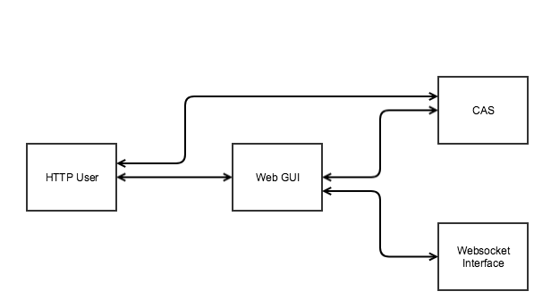
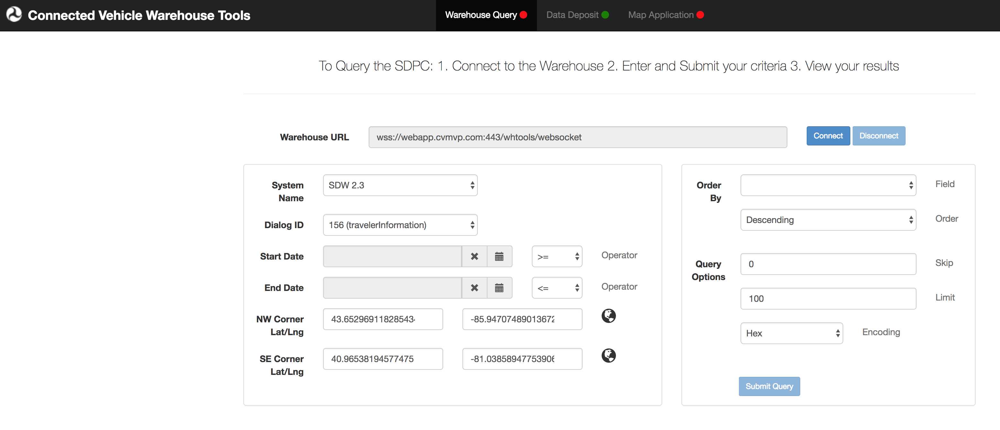
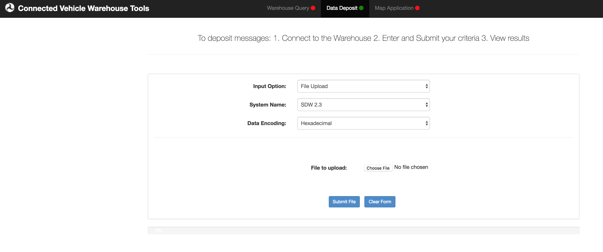

# Connected Vehicles Warehouse Tools Webapp Project

The fedgov-cv-whtools-webapp project is a webapp providing tools to access the Connected Vehicle Warehouses.







<a name="toc"/>

## Table of Contents

[I. Release Notes](#release-notes)

[II. Documentation](#documentation)

[III. Getting Started](#getting-started)

[IV. Running the Application (Standalone)](#running-standalone)

[V. Running the Application (Docker)](#running-docker)

[VI. CI/CD](#cicd)

---

<a name="release-notes" id="release-notes"/>

## [I. Release Notes](ReleaseNotes.md)

<a name="documentation"/>

## II. Documentation

This repository produces a WAR file containing a Jetty Servlet, so it can be deployed on any Jetty server that supports websockets.

The application can also be deployed using a docker container. This container will run the application under a Jetty server, and can be configured to use SSL certificates.

<a name="getting-started"/>

## III. Getting Started

The following instructions describe the proceedure to fetch, build, and run the application

### Prerequisites
* JDK 1.8: http://www.oracle.com/technetwork/pt/java/javase/downloads/jdk8-downloads-2133151.html
* Maven: https://maven.apache.org/install.html
* Git: https://git-scm.com/
* Docker: https://docs.docker.com/engine/installation/
* SDW Websockets Interface: https://github.com/usdot-jpo-sdcsdw/fedgov-cv-webapp-websocket
* PerXerCodec: https://github.com/usdot-jpo-sdcsdw/per-xer-codec

---
### Obtain the Source Code

#### Step 1 - Clone public repository

Clone the source code from the GitHub repository using Git command:

```bash
git clone TBD
```

<a name="running"/>

## IV. Running the application (Standalone)

---
### Build and Deploy the Application

**Step 1**: Build the WAR file

```bash
mvn package
```

**Step 2**: Deploy the WAR file

```bash
# Consult your webserver's documentation for instructions on deploying war files 
cp target/whtools.war ... 
```

<a name="running-docker"/>

## V. Running the Application (Docker)

---
### Build and Deploy the Application

**Step 1**: Build the WAR file

```bash
mvn package
```

**Step 2**: Build the Docker image, providing the path to the native library for the PER-XER codec

```bash
docker build -t dotcv/whtools-webapp --build-arg CODEC_SO_PATH=... .
```

This path depends on which OS you are building on. If you are building on a Linux system, codec is located at target/libper-xer-codec.so after running the maven build.
If you are building on OSX, you will need to provide the path to the Linux SO you built manually, according to the instructions provided by that project.

**Step 3**: Run the Docker image in a Container, mounting the SSL certificate keystore directory, and specifying the following:
* Keystore filename
* Keystore password
* HTTP Port
* HTTPS Port


```bash
docker run -p HTTP_PORT:8080 \
           -p HTTPS:_PORT:8443 \
           -e JETTY_KEYSTORE_PASSWORD=... \
           -v KEYSTORE_DIRECTORY:/usr/local/jetty/etc/keystore_mount \
           -e JETTY_KEYSTORE_RELATIVE_PATH=... \
            dotcv/whtools-webapp:latest
```

<a name="cicd"/>

## VI CI/CD

The project can be built using a Jenkins CI/CD server, equipped with the following plugins:
* Docker: TBD
* Pipeline: TBD
* Maven: TBD
* EnvInject: TBD

In addition, the following variables will need to be set using the EnvInject plugin:
* DOCKER_IMAGE - Image name
* DOCKER_URL - URL for the Docker Repo to push to
* DOCKER_CRED - Credentials to the Docker Repo

</a>